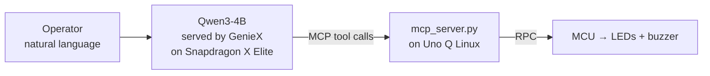
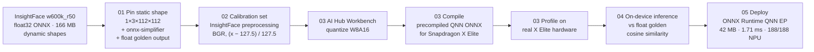

# Snapdragon Edge Access Control

**On-device face recognition on the Snapdragon X Elite NPU, driving a physical
access indicator on an Arduino Uno Q — no camera frame ever leaves the laptop.**

A phone or webcam feeds frames to a laptop. YOLOv5-Face finds faces, a
quantized InsightFace (ArcFace ResNet-50) model compiled for the Hexagon NPU
turns each face into a 512-number identity embedding, and a cosine match against
a local allow-list decides *authorized* or *unauthorized*. Only that small JSON
verdict leaves the laptop. An Arduino Uno Q receives it and shows one LED per
person — green or red — and beeps on a refusal.

---

## Contents

1. [Results at a glance](#results-at-a-glance)
2. [Why it matters](#why-it-matters)
3. [System architecture](#system-architecture)
4. [On-device AI: the right runtime for each workload](#on-device-ai-the-right-runtime-for-each-workload)
5. [How we use GenieX](#how-we-use-geniex)
6. [Quantization and compilation](#quantization-and-compilation)
7. [Optimizations](#optimizations)
8. [Model evaluation](#model-evaluation)
9. [Edge hardware and real-world connectivity](#edge-hardware-and-real-world-connectivity)
10. [Reliability and observability](#reliability-and-observability)
11. [Privacy and security](#privacy-and-security)
12. [Limitations and what's next](#limitations-and-whats-next)
13. [Presenting this work](#presenting-this-work)
14. [Quick start](#quick-start)
15. [Reproducing the quantized model](#reproducing-the-quantized-model)
16. [Repository layout](#repository-layout)
17. [Credits and licensing](#credits-and-licensing)

---

## Results at a glance

Every number below comes from a Qualcomm AI Hub job on real Snapdragon X Elite
hardware, a measurement on our own laptop, or a test on the physical board.

| What | Result | Evidence |
|---|---|---|
| Face-embedding inference on the NPU | **1.71 ms** | AI Hub profile job [`j568z6jng`](https://workbench.aihub.qualcomm.com/jobs/j568z6jng/), Snapdragon X Elite CRD |
| Embedding inside our running app | **2.06 ms mean, 2.30 ms P95** | Measured on our Snapdragon X Elite laptop (`Qualcomm edge ml/PROJECT_LOG.txt`) |
| Layers running on the NPU | **188 / 188** — zero CPU fallback | AI Hub profile job `j568z6jng` |
| Model size | **166 MB → 42 MB** (~4× smaller) | Float ONNX vs compiled W8A16 context binary |
| Peak inference memory | **45 MB** | AI Hub profile job `j568z6jng` |
| Quantized vs. float output agreement | **cosine 0.9985** | AI Hub inference job [`j5wl3ovzp`](https://workbench.aihub.qualcomm.com/jobs/j5wl3ovzp/) (see [caveat](#limitations-and-whats-next)) |
| Embedding step vs. our previous model | **10.8 ms → 2.06 ms** (~5× faster) | CavaFace float vs. compiled InsightFace W8A16, both measured in-app |
| Physical output | **Green → red on real Arduino Uno Q LEDs**, over an internet relay, from a systemd service that survives reboot | Verified on hardware |
| Data leaving the laptop | **A verdict JSON only** — never an image | Server refuses non-localhost binds |
| Automated tests | **32 passing** | `pytest` in `Qualcomm edge ml/` |

---

## Why it matters

**Privacy by construction.** Faces are biometric data. The camera stream, the
face crops, and the embedding database all stay on the laptop. The web service
that receives raw pixels refuses to bind to anything but `127.0.0.1`. What
leaves the device is a verdict: who is authorized, who is not, and where they
stand in the frame.

**Real-time on the NPU, not the cloud.** Recognition runs on the Hexagon NPU
of the Snapdragon X Elite. There is no per-request cloud inference cost, no
round-trip latency to a data center, and the recognition itself works without
an internet connection.

**From model to physical world.** This is not a notebook demo. A compiled model
drives a running application, which drives a real microcontroller, which drives
real lights — with the failure handling needed to survive a hotel Wi-Fi network.

**Engineering rigor, not just a result.** Every design choice here was measured:
the quantization was verified on hardware, a model that looked promising
(DINOv3) was rejected on evidence, the pipeline bottleneck was located with
timings, and network failures were diagnosed down to the router's own responses.

---

## System architecture

```mermaid
flowchart LR
    subgraph Camera["Camera"]
        P["Phone (MJPEG)<br/>or webcam"]
    end

    subgraph Laptop["Snapdragon X Elite laptop — on-device AI"]
        B["Browser<br/>frame capture"]
        S["Access Vision service<br/>localhost only"]
        D["YOLOv5-Face<br/>detect + 5 landmarks"]
        A["ArcFace alignment<br/>112×112, NumPy"]
        E["InsightFace W8A16<br/>QNN context on Hexagon NPU"]
        M["Cosine match<br/>local allow-list"]
        N["Board notifier<br/>queue · retry · budget"]
        B -->|raw pixels| S --> D --> A --> E --> M --> N
    end

    subgraph Relay["Relay"]
        R["ntfy.sh topic<br/>(or direct HTTP)"]
    end

    subgraph Board["Arduino Uno Q"]
        L["Linux MPU<br/>ntfy poller service"]
        C["MCU firmware<br/>RPC set_people"]
        X["8 × Modulino Pixels<br/>+ buzzer"]
        L -->|arduino-router RPC| C --> X
    end

    P --> B
    N -->|verdict JSON only| R --> L
```



### The verdict contract

The only thing that crosses from the laptop to the board:

```json
{"people": [
  {"id": "alice",   "status": "authorized",   "box": [40, 120, 90, 200],  "confidence": 0.91},
  {"id": "unknown", "status": "unauthorized", "box": [180, 130, 95, 210], "confidence": 0.41}
]}
```

One LED per person, ordered left to right by `box[0]` so the lights match where
people stand. Anything that is not exactly `"authorized"` — including malformed
input — shows red. The board fails closed.

---

## On-device AI: the right runtime for each workload

The Snapdragon X Elite gives us several AI runtimes. Choosing the right one for
each model is a core part of this project.

| Workload | Model type | Runtime | Why |
|---|---|---|---|
| Face detection | CNN (YOLOv5-Face) | ONNX Runtime + **QNN Execution Provider** → Hexagon NPU | Vision graphs compile directly to QNN |
| Face embedding | CNN (InsightFace ArcFace R50) | Pre-compiled **QNN context binary** via ONNX Runtime | Ahead-of-time compiled for the exact SoC; 188/188 layers on NPU |
| Natural-language control of the board | LLM (Qwen3-4B) | **GenieX** | Generative models need tokenization and a decode loop — GenieX's job |
| Incident descriptions *(roadmap)* | VLM | **GenieX** | Asynchronous, event-triggered generative reasoning |

### Why the face model is not in GGUF or a Genie bundle

This was an explicit engineering decision, not an omission:

- **GGUF** is a weight container for transformer LLMs (GenieX can run
  quantized GGUF *LLMs* on the NPU). There is no ONNX→GGUF path for a CNN, and
  no GGUF runtime that would execute a face-embedding network.
- **Genie / GenieX** runs *generative* models: a Genie bundle is context
  binaries plus a tokenizer plus a KV-cache decode loop. A face-embedding CNN
  has no tokenizer and no autoregressive decoding — there is nothing for Genie
  to drive.
- A **QNN context binary**, compiled through Qualcomm AI Hub Workbench, is the
  format that puts a CNN fully on the Hexagon NPU.

---

## How we use GenieX

GenieX is Qualcomm's on-device runtime for generative LLMs and VLMs, serving an
OpenAI-compatible API locally on the laptop.

**1. An on-device AI agent that controls the hardware.** The board project
(the `uno-q-board` submodule) runs **Qwen3-4B-Instruct** locally through GenieX
on the Snapdragon X Elite. Through the Model Context Protocol (MCP), the model is
given the Arduino's capabilities as tools — `check_file` and `set_light` — and
controls the physical light from plain language:

```text
you> check samples/frame_5people.json
you> turn the light red
```



No cloud LLM is involved: the language model, the tool calls, and the hardware
are all local. See [`uno-q-board/x_elite/client.py`](https://github.com/Saurabhkaran11/Qualcomm-ml-infra-hackathon/blob/main/x_elite/client.py)
and the board project's `SNAPDRAGON_SETUP.md`, step 4.

**2. Designed role in Access Vision: incident descriptions (roadmap).** The
security decision stays deterministic — detection, embedding, and a cosine
threshold. GenieX is added *around* it, not *in* it:

```text
unauthorized event  →  one snapshot  →  local GenieX VLM  →  written incident description
```

It runs only when an unauthorized event occurs, never on every frame, so a large
generative model never competes with the real-time vision models for the NPU.
This is designed and documented (`Qualcomm edge ml/possible_optimisations.txt`,
item 7) but not yet implemented.

---

## Quantization and compilation

The embedding model started as InsightFace's `buffalo_l` / `w600k_r50`: a
166 MB float32 ONNX with dynamic input dimensions. It became a 42 MB
W8A16 QNN context binary running entirely on the Hexagon NPU.



### Key decisions

**Static shapes first.** The NPU needs a fully static graph. Dynamic dimensions
are the most common reason layers silently fall back to the CPU. We pinned the
input to `1×3×112×112` and ran `onnx-simplifier` to fold constants before
anything else — which is why the profile shows **188 of 188 layers on the NPU**.

**W8A16, not W8A8.** Weights are stored as INT8, which is what shrinks the model
~4×. Activations stay INT16. Face recognition compares embeddings by cosine
similarity, which is sensitive to activation clipping, so full INT8 activations
risk moving embeddings enough to change who matches. W8A16 keeps the embedding
geometry intact: the quantized model's output agreed with the float model's at
**cosine 0.9985**.

**Pre-compiled QNN context, not a generic ONNX.** The model is compiled ahead of
time for the exact SoC and shipped as an `EPContext` wrapper plus a context
binary. The app skips graph preparation at startup — **352 ms** to load, measured
on our laptop.

**Verified on real hardware before use.** Every stage ran on Qualcomm AI Hub's
hosted Snapdragon X Elite devices:

| Job | Purpose |
|---|---|
| [`jp2r9886g`](https://workbench.aihub.qualcomm.com/jobs/jp2r9886g/) | Quantize to W8A16 |
| [`jpyojee05`](https://workbench.aihub.qualcomm.com/jobs/jpyojee05/) | Compile to precompiled QNN ONNX for X Elite |
| [`j568z6jng`](https://workbench.aihub.qualcomm.com/jobs/j568z6jng/) | Profile: 1.71 ms, 45 MB peak, 188/188 NPU layers |
| [`j5wl3ovzp`](https://workbench.aihub.qualcomm.com/jobs/j5wl3ovzp/) | On-device inference compared against the float golden output |

### The compiled artifact

```text
models/compiled/w600k_r50_qnn_x_elite/
├── w600k_r50_qnn.onnx    333 B   EPContext wrapper — load this in ONNX Runtime
└── model.bin              42 MB  compiled Hexagon context binary
```

The two files must stay together, and `model.bin` must keep its name: the
wrapper references it by relative path.

| | |
|---|---|
| Source | InsightFace `buffalo_l` / `w600k_r50` (ArcFace ResNet-50) |
| Target | Snapdragon X Elite, Hexagon NPU |
| Precision | INT8 weights / INT16 activations |
| Input | `input.1`, `1×3×112×112`, BGR, `(x − 127.5) / 127.5` |
| Output | 512-dimensional embedding (L2-normalized before comparison) |

---

## Optimizations

### Model and runtime

| Optimization | Effect |
|---|---|
| Static input shapes + graph simplification | Entire graph on the NPU: 188/188 layers, no CPU fallback |
| W8A16 post-training quantization | 166 MB → 42 MB; output agreement cosine 0.9985 |
| Ahead-of-time QNN context compilation for the exact SoC | No graph preparation at startup; 352 ms model load |
| Embedder upgrade (CavaFace float → InsightFace W8A16) | Embedding step 10.8 ms → 2.06 ms |
| QNN HTP `burst` performance mode | Highest-performance NPU power profile during inference |
| **Strict NPU enforcement** (`require_npu = true`) | The app refuses to start on CPU instead of silently running 10× slower |
| NPU device attached via `add_provider_for_devices` | Avoids a known trap where a plugin execution provider silently creates a CPU-only session |

### Application pipeline

| Optimization | Effect |
|---|---|
| OpenCV, Pillow, and FFmpeg removed | Resize, ArcFace alignment, NMS, and matching in NumPy; lean ARM64 install |
| Five-point ArcFace similarity alignment | Faces normalized to the geometry the model was trained on (covered by a geometry test) |
| Adaptive capture loop | The browser never builds a backlog of stale frames when inference is slower than capture |
| Multiple templates per identity, not an average | Every enrollment photo kept; matching takes the best score across angles and lighting |
| One embedding database per model | Embeddings from different models are never mixed |
| Asynchronous board notifier | Inference never waits on the network; sending runs on its own thread |
| Live config hot reload | Edit the config while running; a broken edit keeps the last good runtime |
| Live start/stop from the dashboard | Stop and restart the NPU runtime without restarting the service |

### The next big win, located by measurement

Timings show where the time goes. With one face in frame:

| Stage | Mean latency |
|---|---|
| YOLOv5-Face detector (generic float ONNX) | **83.5 ms** |
| Face embedding (compiled W8A16 InsightFace) | 2.06 ms |

The embedder is solved. **The detector is now ~97% of inference time.** Qualcomm
publishes these Snapdragon X Elite timings for its optimized YOLOv5-Face
([Hugging Face: qualcomm/YoloV5-Face](https://huggingface.co/qualcomm/YoloV5-Face)):

| Qualcomm-optimized YOLOv5-Face | Published latency |
|---|---|
| QNN, float | 4.654 ms |
| QNN, W8A16 | 5.046 ms |
| ONNX, float | 13.752 ms |
| ONNX, W8A16 | 14.571 ms |

Even the slowest of those is ~6× faster than our current 83.5 ms detector, and
the pre-compiled QNN path we already use for the embedder is the one that
approaches the QNN numbers. Running the detector through the same
quantize-compile-profile pipeline is the highest-impact next step. Note that
quantization is not automatically faster here — the float QNN build is quicker
than W8A16 — so each variant must be profiled.

---

## Model evaluation

We didn't assume the first model was the right one. Four embedders were tested:

| Embedder | Output | Result |
|---|---|---|
| MobileFaceNet W8A16 | 128-D | Initial experiment; replaced |
| CavaFace float | 512-D | Reliable baseline; 10.8 ms per face in-app |
| DINOv3 ViT-S | 384-D | **Rejected**: same-person and different-person scores overlapped. A general vision backbone is not an identity model without face-specific fine-tuning |
| **InsightFace W600K R50 W8A16** | 512-D | **Current default**: purpose-built face-recognition model, compiled for the NPU, 2.06 ms in-app |

Each embedder keeps its own config file and database, so results stay
reproducible and comparable.

---

## Edge hardware and real-world connectivity

### The Arduino Uno Q

The Uno Q pairs a Linux processor (MPU) with a real-time microcontroller (MCU):

- The **Linux side** runs a small Python service that receives verdicts.
- The **`arduino-router`** service carries MessagePack-RPC calls from Linux to the MCU.
- The **MCU firmware** sets 8 Modulino Pixels and drives the buzzer.

**Self-sufficient.** The board runs its listener as a systemd user service with
lingering enabled. It starts at boot with nobody logged in, restarts itself if
it crashes, and needs no laptop cable — just power and Wi-Fi.

**Fail-closed with a stale watchdog.** Malformed input shows red. If no verdict
arrives for 25 seconds, the board clears its lights: a stale green light after
the laptop stops is the one thing an access display must never show.

### Making it work on a real network

Getting two devices to talk in a hotel turned out to be the hardest engineering
problem in the project. Each step was diagnosed from evidence:

| Problem found | Evidence | Resolution |
|---|---|---|
| Guest Wi-Fi blocks device-to-device traffic (client isolation) | Laptop → board ping answered by the **router** with `Destination net unreachable` | Relay design: both sides make only *outbound* connections |
| Captive portal blocks all internet traffic from the board | HTTP answered with a redirect to a splash page; HTTPS answered `No route to host` | Moved both devices to a phone hotspot |
| Public relay rate limit | Publishing once a second: 81 accepted, then only 1 in 4 | Client-side send budget that mirrors the relay's limit |
| Public relay **daily quota** | Relay reply: `daily message quota reached` (250/day per IP, documented) | Detected explicitly, logged loudly, publishing paused, changes kept; direct HTTP recommended for long runs |

### Delivery guarantees in the board notifier

- **Changes are queued and delivered in order.** A red state is never overwritten
  by a later frame before it is sent.
- **Failed changes are retried**, not dropped.
- **Heartbeats** resend the current state while frames arrive, as proof the relay
  is flowing.
- **A send budget** mirrors the relay's rate limit. Tokens are reserved so a change
  still goes out immediately after a long run of heartbeats.
- **The relay's daily quota is recognized** from its own error response. The
  notifier logs one clear error, stops hammering, and keeps changes queued.

---

## Reliability and observability

**Every send is logged at INFO**, so a healthy system is visibly healthy — not
merely quiet:

```text
INFO Board updated (change): 1 people (0 authorized, 1 denied) [unknown:unauthorized] -> published to https://ntfy.sh/... [queued=0, budget=38]
INFO Board updated (heartbeat): 1 people (1 authorized, 0 denied) [alice:authorized] -> published to https://ntfy.sh/... [queued=0, budget=37]
```

**Failures are loud once, then periodic**, instead of spamming or going silent:

```text
WARNING Board send FAILED (...): ... -- continuing without it
ERROR   Board relay DAILY QUOTA EXHAUSTED: ... The board will receive nothing -- not even changes -- until the quota resets. ...
```

**A live traffic terminal.** `Qualcomm edge ml/scripts/watch_verdicts.py`
subscribes to the relay independently and prints each verdict as it arrives,
color-coded. It uses the board's own decision function, so it shows exactly what
the board will do.

**A preflight check.** `Qualcomm edge ml/scripts/preflight_insightface.py`
catches the misconfigurations that don't crash but produce wrong matches: the
wrong channel order, normalization, or alignment, or a database built by a
different 512-D model.

**Tests.** 32 automated tests cover the verdict contract, alignment geometry,
detector decoding, matching, queue ordering, retries, the send budget, and relay
error handling.

**Hardware-verified.** The whole path — laptop, internet relay, board service,
RPC, MCU, LEDs — was exercised on the physical Arduino Uno Q.

---

## Privacy and security

- **Raw frames never leave the laptop.** The service receiving pixels only binds to localhost.
- **Biometric data stays local.** The embedding database is a local file and is not committed.
- **What leaves:** the verdict JSON — identity labels (such as an enrolled name), status, box, and confidence.
- **Public relay caveat:** anyone who knows an ntfy.sh topic name can read it and publish to it. That is fine for a demo; for real deployment use direct HTTP on a private network, a self-hosted relay, or authenticated topics.
- **Board token:** the direct-HTTP listener checks a shared secret supplied through the environment.

---

## Limitations and what's next

We're explicit about what is and isn't proven:

| Limitation | Status / next step |
|---|---|
| Quantization was calibrated on synthetic data, and the cosine 0.9985 check used one input | Recalibrate with ~200 real, aligned faces from our cameras; measure on real genuine and impostor pairs |
| Matching threshold (0.36) is a starting point, not calibrated | Calibrate on our own camera, lighting, and distance conditions |
| Detector is a generic float model (83.5 ms) | Compile YOLOv5-Face through the same Workbench pipeline (Qualcomm publishes 4.65–14.57 ms depending on runtime and precision) |
| Public relay allows 250 messages/day per IP | Switch to direct HTTP on the shared hotspot (no quota) or a paid tier |
| Compiled context is specific to Snapdragon X Elite | Recompile per target SoC (one flag) |
| GenieX incident descriptions | Designed; not yet implemented in Access Vision |
| Temporal tracking | Detect every few frames, track boxes between detections, re-identify every 0.5–1 s |

---

## Presenting this work

### One sentence

> We compiled a production face-recognition model to run entirely on the
> Snapdragon X Elite NPU — 4× smaller, 1.71 ms per face, zero CPU fallback — and
> used it to drive a self-sufficient Arduino access indicator, with no camera
> frame ever leaving the device.

### Three messages to land

1. **Real on-device AI performance, proven on hardware.** 188/188 layers on the NPU,
   1.71 ms, 42 MB — from Qualcomm AI Hub jobs, not estimates.
2. **The right Snapdragon runtime for each job.** QNN for vision models, GenieX for
   generative AI — and a clear reason why each model runs where it does.
3. **End to end, in the physical world.** Camera → NPU → decision → microcontroller → light,
   engineered to survive a real network.

### Suggested slides

| # | Slide | Show |
|---|---|---|
| 1 | Title & one-liner | The sentence above; photo of the lit board |
| 2 | The problem | Access control usually streams faces to a server. Biometric data leaves the building |
| 3 | Our approach | Architecture diagram: phone → laptop NPU → verdict JSON → Arduino |
| 4 | Results at a glance | The results table: 1.71 ms, 188/188, 4× smaller, cosine 0.9985 |
| 5 | Quantization pipeline | Pipeline diagram; W8A16 reasoning; AI Hub job IDs |
| 6 | Right runtime per workload | QNN vs. GenieX table; why not GGUF or a Genie bundle for a CNN |
| 7 | GenieX in the system | Qwen3-4B on-device agent controlling the board through MCP; incident-description roadmap |
| 8 | Engineering rigor | Model evaluation, including DINOv3 rejected on evidence; bottleneck located (detector is ~97% of time) |
| 9 | Real-world deployment | Client isolation → captive portal → relay limits, each diagnosed from evidence |
| 10 | Reliability | Queue, retries, budget, fail-closed, stale watchdog, live logs, 32 tests |
| 11 | Live demo | Authorized face → green; unknown face → red + beep; `watch_verdicts.py` on screen |
| 12 | What's next | Optimized detector (Qualcomm publishes 4.65 ms on QNN), real-face calibration, GenieX incident reports |

### Demo script

1. Start the board (power only), then the laptop app, and open `watch_verdicts.py` beside the dashboard.
2. An enrolled person steps in → dashboard green box → terminal `AUTHORIZED` → board LED green.
3. An unknown person steps in → red box → `UNAUTHORIZED` → board LED red, buzzer beeps.
4. Both in frame → two LEDs, left to right, matching where they stand.
5. Everyone leaves → lights clear.
6. Point at the laptop log line `Board updated ...` as live proof of delivery.

**Before a long demo:** use direct HTTP or a fresh relay quota. At one heartbeat
per second, public ntfy.sh's 250-message daily quota runs out in about 17 minutes.

### Questions to expect

| Question | Answer |
|---|---|
| How accurate is it? | The quantized model matches the float model's output (cosine 0.9985). End-to-end verification accuracy on real faces is our next measurement, and we've said so rather than guess |
| Why not run it in the cloud? | Privacy, latency, cost, and offline operation — the whole decision happens on the laptop |
| Why is the detector not quantized yet? | We measured first. The embedder was the model we could fully control; timings now show the detector is the bottleneck, and the pipeline to fix it is ready |
| Where is GenieX? | Driving the hardware through an on-device LLM agent, and designed for incident descriptions. Face recognition runs on QNN because GenieX serves generative models, not CNNs |
| What if the network drops? | Recognition continues; board updates are queued and retried; the board clears stale lights after 25 s rather than showing a wrong green |

---

## Quick start

### Requirements

- Snapdragon X Elite laptop with **native Windows ARM64 Python 3.11**
  (`onnxruntime-qnn` does not load under emulated x64 Python)
- Arduino Uno Q with Modulino Pixels (and buzzer), firmware flashed per the board project
- A phone with an MJPEG camera app (such as DroidCam), or the laptop webcam

### 1. Clone with the board submodule

```powershell
git clone --recurse-submodules https://github.com/Soorya2201/qualcomm-insightface-npu
cd qualcomm-insightface-npu\"Qualcomm edge ml"
```

### 2. Install

```powershell
py -V:3.11-arm64 -m venv .venv311
.\.venv311\Scripts\Activate.ps1
python -c "import platform; print(platform.machine())"   # must print ARM64
python -m pip install -e ".[dev]"
```

Place the YOLOv5-Face ONNX at `models/yolov5n-face-onnx-float/yolov5n_face.onnx`
(see [`Qualcomm edge ml/README.md`](Qualcomm%20edge%20ml/README.md#models)). The
compiled InsightFace model is already in this repository.

### 3. Check the configuration

```powershell
python scripts\preflight_insightface.py --config config.insightface.toml
```

### 4. Enroll allowed people (once)

Put 3–4 clear photos per person in `data/allowed_people/<name>/`, then:

```powershell
python -m access_vision.enroll --config config.insightface.toml
```

### 5. Run

```powershell
$env:NTFY_TOPIC = "your-long-random-topic"   # same topic as the board service
python -m access_vision.cli --config config.insightface.toml
```

In a second terminal, watch verdicts arrive:

```powershell
$env:NTFY_TOPIC = "your-long-random-topic"
python scripts\watch_verdicts.py
```

### 6. Board setup

Install the board-side listener as a boot-time service. Full steps:
[`uno-q-listener/README.md`](uno-q-listener/README.md). Troubleshooting:
[`Qualcomm edge ml/ARDUINO_RELAY_TROUBLESHOOTING.md`](Qualcomm%20edge%20ml/ARDUINO_RELAY_TROUBLESHOOTING.md).

---

## Reproducing the quantized model

The scripts in [`scripts/`](scripts) rebuild the compiled model from the original
InsightFace ONNX. They need a free Qualcomm AI Hub API token.

```bash
qai-hub configure --api_token <YOUR_TOKEN>
```

**1. Pin static shapes and save the float reference output**

```bash
python scripts/01_prepare_onnx.py models/onnx/w600k_r50.onnx \
    --shape 1,3,112,112 --out models/prepared/w600k_r50_static.onnx
```

**2. Build the calibration set** — use real, aligned faces from your cameras

```bash
python scripts/02_make_calib.py --images ./calib --shape 1,3,112,112 --n 256 \
    --input-name "input.1" --out models/prepared/calib_w600k.npz
```

Calibration preprocessing must match inference exactly: five-point alignment to
112×112, BGR, `(x − 127.5) / 127.5`.

**3. Quantize, compile, and profile on a hosted Snapdragon X Elite**

```bash
python scripts/03_compile_aihub.py \
    --model models/prepared/w600k_r50_static.onnx \
    --calib models/prepared/calib_w600k.npz \
    --device "Snapdragon X Elite CRD" \
    --precision w8a16 --runtime precompiled_qnn_onnx --profile
```

**4. Verify on the device against the float output**

```bash
python scripts/04_verify.py --target <compiled model or AI Hub model id> \
    --golden models/prepared/w600k_r50_static_golden.npz --input-name "input.1"
```

For an embedding model, cosine similarity is the metric that matters. Below about
0.99, you have a calibration or precision problem.

**5. Benchmark on the laptop**

```powershell
python scripts\05_run_on_device.py `
    --model models\compiled\w600k_r50_qnn_x_elite\w600k_r50_qnn.onnx --bench 100
```

It prints the active execution providers and warns loudly if QNN did not load.

**Deployment notes**

- A compiled context is **SoC-specific**. A context built for X Elite will not load on X Plus or X2 Elite; recompile per target.
- Check the profile's NPU layer count. Anything below the total means CPU fallback and explains poor latency.

---

## Repository layout

```text
qualcomm-insightface-npu/
├── README.md                          ← you are here
├── scripts/                           quantize-compile-verify pipeline (AI Hub Workbench)
│   ├── 01_prepare_onnx.py             static shapes, simplify, float golden output
│   ├── 02_make_calib.py               calibration set with InsightFace preprocessing
│   ├── 03_compile_aihub.py            quantize (W8A16), compile, profile
│   ├── 04_verify.py                   on-device inference vs float, cosine similarity
│   └── 05_run_on_device.py            ONNX Runtime QNN EP runner and benchmark
├── models/compiled/w600k_r50_qnn_x_elite/
│   ├── w600k_r50_qnn.onnx             EPContext wrapper
│   └── model.bin                      compiled Hexagon context binary (42 MB)
├── Qualcomm edge ml/                  Snapdragon Access Vision application
│   ├── src/access_vision/             detection, alignment, embedding, matching, server, board notifier
│   ├── scripts/                       preflight, live verdict watcher, debugging, DINOv3 compile
│   ├── tests/                         32 automated tests
│   ├── config.insightface.toml        reference configuration for the compiled model
│   ├── ARDUINO_RELAY_TROUBLESHOOTING.md
│   ├── PROJECT_LOG.txt                models evaluated and measured performance
│   └── possible_optimisations.txt     profiling-driven optimization plan, GenieX design
├── uno-q-listener/                    board-side services (run on the Uno Q Linux side)
│   ├── ntfy_poller.py                 relay subscriber → RPC → LEDs, with stale watchdog
│   ├── verdict_server.py              direct-HTTP listener alternative
│   └── *.service                      systemd units
└── uno-q-board/                       submodule: Uno Q firmware, RPC, MCP server, GenieX client
```

---

## Credits and licensing

- **Arduino Uno Q firmware, RPC tooling, MCP server, and GenieX client**:
  [Saurabhkaran11/Qualcomm-ml-infra-hackathon](https://github.com/Saurabhkaran11/Qualcomm-ml-infra-hackathon),
  included as a submodule (referenced, not copied). Its `rpc_base.py` derives from
  [DerrickJ1612/snapdragon-mcp-arduino](https://github.com/DerrickJ1612/snapdragon-mcp-arduino) (MIT).
- **InsightFace models** by deepinsight are released for **non-commercial research use**.
  That license also governs the compiled artifact in this repository.
  See [deepinsight/insightface](https://github.com/deepinsight/insightface).
- **YOLOv5-Face ONNX export** used by the application is GPL-licensed
  ([yakhyo/yolov5-face-onnx-inference](https://github.com/yakhyo/yolov5-face-onnx-inference)).
- **Pipeline code** in this repository is MIT.
- Built with **Qualcomm AI Hub Workbench**, **ONNX Runtime QNN Execution Provider**, and **GenieX**.
